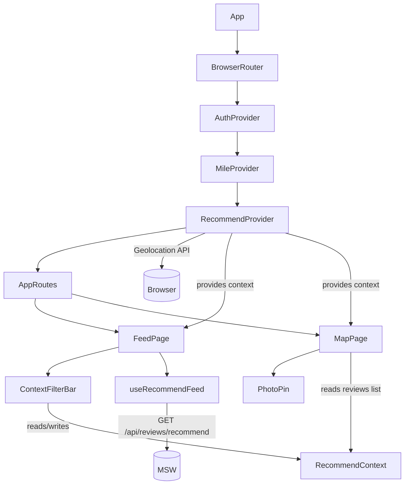
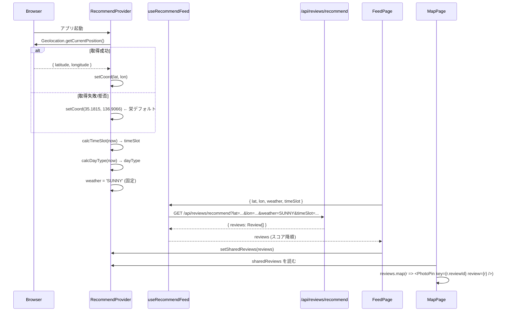
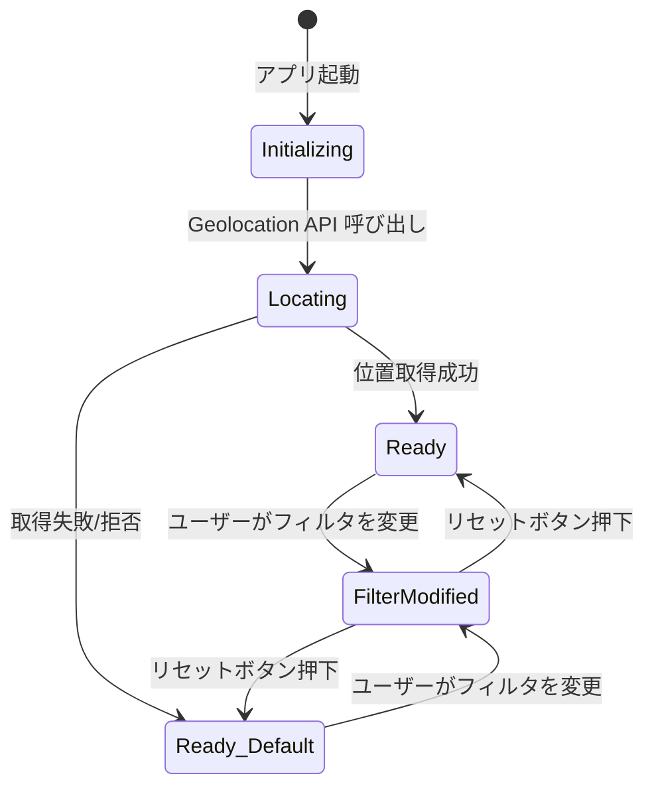

# 設計書 — コンテキスト対応フィード・マップ連携

## 概要 (Overview)

本設計書は「コンテキスト対応フィード・マップ連携」機能の技術設計を定義する。
ユーザーの現在地・時間帯・曜日種別を自動取得し、`/api/reviews/recommend` を用いてスコア降順の口コミを表示する。
フィード画面（`FeedPage`）とマップ画面（`MapPage`）の間でフィルタ状態を共有し、マップ上に写真付きピンを表示する。

### スコープ

| 対象 | 内容 |
|------|------|
| 新規ファイル | `RecommendContext.tsx`, `useRecommendFeed.ts`, `ContextFilterBar.tsx`, `PhotoPin.tsx` |
| 変更ファイル | `App.tsx`, `FeedPage.tsx`, `MapPage.tsx` |
| 変更なし | `useReviewFeed.ts`（既存フィードフックはそのまま残す）、型定義、MSWハンドラー |

---

## アーキテクチャ (Architecture)

### コンポーネントツリー



### データフロー



---

## コンポーネントとインターフェース (Components and Interfaces)

### 1. `RecommendContext.tsx` — コンテキストプロバイダー

`AuthContext.tsx` のパターンに倣い `createContext` + カスタムフックで実装する。

```typescript
// RecommendContextの公開インターフェース
interface RecommendState {
  // ---- コンテキスト値（自動取得） ----
  coord: { lat: number; lon: number }
  weather: Weather                  // 常に 'SUNNY'
  timeSlot: TimeSlot                // 現在時刻から自動計算
  dayType: DayType                  // 現在曜日から自動計算

  // ---- フィルタ状態（ユーザーが変更可能） ----
  filterTimeSlot: TimeSlot
  filterDayType: DayType
  setFilterTimeSlot: (ts: TimeSlot) => void
  setFilterDayType: (dt: DayType) => void
  resetFilters: () => void
  isFilterModified: boolean         // フィルタがデフォルト（Context値）から変更されているか

  // ---- フィード・マップ間の共有口コミリスト ----
  sharedReviews: Review[]
  setSharedReviews: (reviews: Review[]) => void

  // ---- ローディング・エラー状態 ----
  locating: boolean                 // Geolocation取得中フラグ
  locationError: string | null      // 位置情報エラーメッセージ（3秒で自動クリア）
}
```

**実装上の注意点:**
- `createContext<RecommendState | null>(null)` で初期化
- `useRecommendContext()` カスタムフックで null ガードを行い、Provider 外で使った場合はエラーをスロー
- `locationError` は `setTimeout` で 3秒後に `null` にリセット
- `isFilterModified` は `filterTimeSlot !== timeSlot || filterDayType !== dayType` で算出（useMemo推奨）

### 2. `useRecommendFeed.ts` — レコメンドフィード取得フック

```typescript
interface RecommendFeedState {
  reviews: Review[]
  loading: boolean
  error: string | null
}

interface RecommendFeedParams {
  lat: number
  lon: number
  weather: Weather
  timeSlot: TimeSlot
}

function useRecommendFeed(params: RecommendFeedParams): RecommendFeedState
```

**実装詳細:**

- `params` の変化を `JSON.stringify(params)` のキーで検知し、変化のたびに再フェッチ
- `/api/reviews/recommend?lat=${lat}&lon=${lon}&weather=${weather}&timeSlot=${timeSlot}` を呼ぶ
- 取得した `reviews` を `FeedPage` から `setSharedReviews()` に渡す（最大20件はAPIが保証）
- ページネーションなし（`/api/reviews/recommend` は最大20件固定）

### 3. `ContextFilterBar.tsx` — フィルタバーUI

```typescript
interface ContextFilterBarProps {
  // なし。useRecommendContext() から全データを取得
}
```

**表示内容:**
- ローディング中: スピナーアニメーション
- エラー時: `locationError` 文字列（3秒自動消滅）
- 通常: `timeSlot` チップ + `dayType` チップ
- フィルタ変更時: チップの背景色をオレンジに変更（`isFilterModified` が true のとき）
- `isFilterModified` が true のとき: リセットボタンを表示

**チップのaria-label形式:**
- 時間帯: `"時間帯フィルタ: {timeSlotLabel} ({timeRange})"` （例: `"時間帯フィルタ: 昼 (10〜16時)"`）
- 曜日種別: `"曜日フィルタ: {dayTypeLabel}"` （例: `"曜日フィルタ: 平日"`）

### 4. `PhotoPin.tsx` — 写真ピンコンポーネント

react-leaflet で `DivIcon` をカスタマイズして写真ピンを実装する。

```typescript
interface PhotoPinProps {
  review: Review
}
```

**実装アプローチ:**

```typescript
import L from 'leaflet'
import { renderToStaticMarkup } from 'react-dom/server'
import { Marker, Popup } from 'react-leaflet'

function PhotoPin({ review }: PhotoPinProps) {
  const iconHtml = renderToStaticMarkup(
    <PhotoChipHtml review={review} />
  )
  const icon = L.divIcon({
    html: iconHtml,
    className: '',          // leaflet のデフォルトスタイルを除去
    iconSize: [40, 40],
    iconAnchor: [20, 20],
  })

  return (
    <Marker
      position={[review.lat, review.lon]}
      icon={icon}
    >
      <Popup>
        <ReviewPopupContent review={review} />
      </Popup>
    </Marker>
  )
}
```

**Photo_Chip HTMLの構造:**
- `photoUrls[0]` が存在する場合: `` タグ（`w-10 h-10 rounded-full object-cover border-2 border-white shadow-md`）
- `photoUrls` が空の場合: `<div>` オレンジドット（`w-10 h-10 rounded-full bg-orange-500 border-2 border-white shadow-md`）

**ReviewPopupContent の内容:**
- `spotName`（フォント太字）
- `text.slice(0, 60) + (text.length > 60 ? '…' : '')` （本文60文字）
- `likeCount` 表示
- `<Link to={/reviews/${reviewId}}>口コミを見る</Link>` リンク
- `role="dialog"` は `<Popup>` の `className` + `useEffect` でフォーカス移動を実装

---

## データモデル (Data Models)

### RecommendContext の状態遷移



### コンテキスト計算関数

**`calcTimeSlot(hour: number): TimeSlot`**

| 入力範囲 | 出力 |
|----------|------|
| 5 ≤ hour ≤ 9 | `'MORNING'` |
| 10 ≤ hour ≤ 16 | `'AFTERNOON'` |
| 17 ≤ hour ≤ 20 | `'EVENING'` |
| 0 ≤ hour ≤ 4 または 21 ≤ hour ≤ 23 | `'NIGHT'` |

**`calcDayType(day: number): DayType`**

| 入力 | 出力 |
|------|------|
| 0 (日曜) または 6 (土曜) | `'HOLIDAY'` |
| 1〜5 (月〜金) | `'WEEKDAY'` |

### 変更が必要な既存ファイル

**`App.tsx` の変更点:**
```typescript
// 変更前
<MileProvider>
  <AppRoutes />
</MileProvider>

// 変更後
<MileProvider>
  <RecommendProvider>
    <AppRoutes />
  </RecommendProvider>
</MileProvider>
```

**`FeedPage.tsx` の変更点:**
- `useState` による手動フィルタ（area, weather, timeSlot）を削除
- `useRecommendContext()` からフィルタ状態を取得
- `useReviewFeed` → `useRecommendFeed` に切り替え
- ヘッダー内に `<ContextFilterBar />` を追加
- `reviews` を取得後に `setSharedReviews(reviews)` を呼ぶ（`useEffect` で監視）

**`MapPage.tsx` の変更点:**
- `Marker` + `SpotPopup` によるスポット表示から、`PhotoPin` による口コミ表示に切り替え
- `useRecommendContext()` から `sharedReviews` を取得
- `fetchSpots` / `spots` state は削除（または既存のスポット表示と共存させる設計判断はタスク実装時に確認）
- 空リスト時のメッセージ表示を追加

---

## 正当性プロパティ (Correctness Properties)

*プロパティとは、システムの全ての有効な実行において成立すべき特性や振る舞いのこと——本質的には、システムが何をすべきかについての形式的な記述である。プロパティは人間が読める仕様と機械検証可能な正当性保証の橋渡しをする。*

### Property 1: 時間帯変換の網羅性

*任意の* 0〜23 の整数時刻 `hour` に対して、`calcTimeSlot(hour)` は必ず `MORNING`・`AFTERNOON`・`EVENING`・`NIGHT` のいずれかを返し、かつ各時刻の区分は要件定義の境界（5-9=MORNING, 10-16=AFTERNOON, 17-20=EVENING, 21-4=NIGHT）に厳密に従う。

**Validates: Requirements 1.4**

---

### Property 2: 曜日種別変換の網羅性

*任意の* 0〜6 の整数曜日値 `day`（0=日, 6=土, 1-5=月〜金）に対して、`calcDayType(day)` は 0 と 6 に対して `HOLIDAY` を返し、1〜5 に対して `WEEKDAY` を返す。

**Validates: Requirements 1.5**

---

### Property 3: 位置取得失敗時のデフォルトフォールバック

*任意の* Geolocation エラー（コード・メッセージを問わず）に対して、`RecommendProvider` の `coord` は必ず栄のデフォルト座標（lat: 35.1815, lon: 136.9066）になる。

**Validates: Requirements 1.3**

---

### Property 4: フィルタリセットの冪等性（ラウンドトリップ）

*任意の* `timeSlot` と `dayType` の組み合わせでフィルタを変更した後にリセットを実行すると、`filterTimeSlot` と `filterDayType` は必ず Context の自動取得値（`timeSlot`・`dayType`）と等しくなり、`isFilterModified` は `false` になる。

**Validates: Requirements 3.5, 2.5**

---

### Property 5: レコメンドAPIクエリパラメータの正確な伝達

*任意の* 有効な `{ lat, lon, weather, timeSlot }` 値を持つ `RecommendFeedParams` に対して、`useRecommendFeed` が発行する HTTP リクエストの URL は、それらの値を正確にクエリパラメータとして含む。

**Validates: Requirements 2.2, 6.1**

---

### Property 6: 写真ピンのphotoUrls[0]使用とフォールバック

*任意の* `Review` オブジェクトに対して `PhotoPin` をレンダリングしたとき、`photoUrls` が非空なら `photoUrls[0]` が `img` 要素の `src` として使われ、`photoUrls` が空配列なら代替のオレンジドット要素がレンダリングされる。

**Validates: Requirements 5.1, 5.7**

---

### Property 7: ポップアップのコンテンツ完整性

*任意の* `Review` オブジェクト（任意の `spotName`・`text`・`likeCount`）に対して `PhotoPin` のポップアップをレンダリングしたとき、`spotName` 全文、`text` の先頭60文字、`likeCount` 値、`/reviews/{reviewId}` へのリンクがすべてポップアップ内に含まれる。

**Validates: Requirements 5.5, 5.6**

---

### Property 8: aria-labelの動的生成

*任意の* `TimeSlot` 値でフィルタバーをレンダリングしたとき、時間帯チップの `aria-label` は現在の `TimeSlot` の日本語ラベルと時間帯区間文字列を含む。

**Validates: Requirements 8.1**

---

### Property 9: 共有口コミリストのマップピン反映

*任意の* 最大20件の `Review[]` を `sharedReviews` として設定したとき、`MapPage` は同じ件数の `PhotoPin` をマップ上にレンダリングする。

**Validates: Requirements 4.3**

---

## エラーハンドリング (Error Handling)

| エラーケース | 処理方法 |
|-------------|---------|
| Geolocation 拒否 | デフォルト座標（栄）にフォールバック。`locationError` に「現在地を取得できませんでした」をセット、3秒後に自動クリア |
| Geolocation タイムアウト | 同上 |
| `/api/reviews/recommend` エラー | `useRecommendFeed` の `error` state にメッセージをセット、`FeedPage` で `role="alert"` バナーとして表示 |
| `photoUrls` 空配列 | `PhotoPin` でオレンジドットにフォールバック（エラーではなく正常系） |
| `img` 読み込み失敗 | `onError` ハンドラーでオレンジドットに切り替え |
| マップ上の空口コミリスト | 「現在の条件に一致する口コミがありません」メッセージを地図オーバーレイとして表示 |

---

## テスト戦略 (Testing Strategy)

### デュアルテストアプローチ

本機能はユニットテスト（例示テスト）とプロパティベーステスト（PBT）の両方を採用する。

- **ユニットテスト**: 具体的なシナリオ、エッジケース、統合ポイントを確認
- **プロパティテスト**: 上記の Correctness Properties を全入力範囲で検証

### PBTライブラリ

TypeScript の PBT には **[fast-check](https://fast-check.dev/)** を使用する。

```bash
npm install --save-dev fast-check
```

各プロパティテストは最低 **100 イテレーション** で実行する（fast-check のデフォルト: 100）。

### テストタグ形式

```typescript
// Feature: context-aware-feed-map, Property {number}: {property_text}
```

### プロパティテストの実装方針

**Property 1 & 2: 変換関数のテスト**
- `calcTimeSlot`・`calcDayType` は純粋関数として `RecommendContext.tsx` から独立したモジュールに抽出する
- `fc.integer({ min: 0, max: 23 })` で hour を生成してテスト
- `fc.integer({ min: 0, max: 6 })` で day を生成してテスト

```typescript
// Feature: context-aware-feed-map, Property 1: 時間帯変換の網羅性
it('Property 1: calcTimeSlot は全時刻で正しい時間帯を返す', () => {
  fc.assert(
    fc.property(fc.integer({ min: 0, max: 23 }), (hour) => {
      const result = calcTimeSlot(hour)
      if (hour >= 5 && hour <= 9) return result === 'MORNING'
      if (hour >= 10 && hour <= 16) return result === 'AFTERNOON'
      if (hour >= 17 && hour <= 20) return result === 'EVENING'
      return result === 'NIGHT'
    })
  )
})
```

**Property 3: フォールバックテスト**
- Geolocation API をモックし、任意のエラーオブジェクトで失敗させる
- `coord` がデフォルト座標になることを確認

**Property 4: リセットのラウンドトリップテスト**
- `fc.constantFrom('MORNING', 'AFTERNOON', 'EVENING', 'NIGHT')` と `fc.constantFrom('WEEKDAY', 'HOLIDAY')` で任意のフィルタ値を生成
- 変更 → リセット後に元の Context 値に戻ることを確認

**Property 5: クエリパラメータテスト**
- `fc.record({ lat: fc.float({min:-90,max:90}), lon: fc.float({min:-180,max:180}), weather: fc.constantFrom('SUNNY'), timeSlot: fc.constantFrom(...) })` で生成
- `msw` モックとの組み合わせで URL パラメータを検証

**Property 6 & 7: レンダリングテスト**
- `fc.record({ spotName: fc.string({minLength:1}), text: fc.string(), likeCount: fc.nat(), photoUrls: fc.array(fc.webUrl()) })` で口コミデータを生成
- `@testing-library/react` でレンダリングして DOM を確認

**Property 8: aria-label テスト**
- `fc.constantFrom('MORNING', 'AFTERNOON', 'EVENING', 'NIGHT')` で TimeSlot を生成
- aria-label にそのラベル文字列が含まれることを確認

**Property 9: マップピンカウントテスト**
- `fc.array(reviewArb, { minLength: 0, maxLength: 20 })` でレビューリストを生成
- `MapPage` をレンダリングして PhotoPin の数が一致することを確認（react-leaflet はモック）

### ユニットテスト（例示テスト）

| テスト対象 | テスト内容 |
|-----------|-----------|
| `ContextFilterBar` | ローディング中スピナー表示 |
| `ContextFilterBar` | エラーメッセージ3秒後消滅（fake timers） |
| `ContextFilterBar` | フィルタ変更時のリセットボタン表示/非表示 |
| `ContextFilterBar` | 時間帯チップタップでドロップダウン表示 |
| `FeedPage` | 初期フィルタが Context 値で設定される |
| `FeedPage` | フィルタ変更後に `setSharedReviews` が更新される |
| `MapPage` | 空リスト時のメッセージ表示 |
| `PhotoPin` | ポップアップに `role="dialog"` が設定される |
| `RecommendProvider` | 初期 `weather` が `'SUNNY'` |

### テストファイル構成

```
src/
  contexts/
    RecommendContext.test.tsx    ← Property 1, 2, 3, 4
  features/
    feed/
      useRecommendFeed.test.ts  ← Property 5
      FeedPage.test.tsx         ← ユニットテスト
    map/
      PhotoPin.test.tsx         ← Property 6, 7, 9
      MapPage.test.tsx          ← ユニットテスト
  components/
    ContextFilterBar.test.tsx   ← Property 8, ユニットテスト
```

### テストツール構成

| ツール | 用途 |
|--------|------|
| Vitest | テストランナー |
| @testing-library/react | コンポーネントレンダリング |
| fast-check | プロパティベーステスト |
| msw | API モック（既存） |
| @testing-library/user-event | ユーザー操作シミュレーション |
