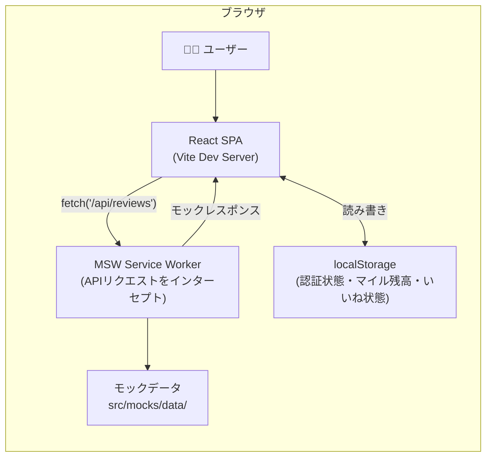

# 技術設計書 — NagoTime デモ版（フロントエンド専用）

## 1. システムアーキテクチャ概要

### 概要

NagoTime デモ版は、地域創生コンテスト向けのブラウザデモアプリである。AWS インフラを一切使用せず、React SPA + MSW（Mock Service Worker）+ ハードコードモックデータのみで構成する。審査員の前でブラウザ上でリアルタイムにデモできる状態を目標とする。

**技術スタック**:
- フロントエンド: React 18 + TypeScript + Vite
- スタイリング: Tailwind CSS v3
- ルーティング: react-router-dom v6
- API モック: MSW v2（ブラウザ内 Service Worker）
- モックデータ: TypeScript ハードコードデータ（`src/mocks/data/`）
- 状態管理: React Context + localStorage
- 地図: react-leaflet v4 + OpenStreetMap（無料・API キー不要）
- テスト: Vitest + Testing Library + fast-check（PBT）

### システム全体図



### ビルド・配信方法

- 開発: `vite dev`（HMR 付きローカルサーバー）
- ビルド: `vite build`（`dist/` に静的ファイルを出力）
- デモ配信: `dist/` を任意の静的ホスティング（GitHub Pages / Netlify / USB 配布）で公開可能

---

## 2. コンポーネント設計

### 2.1 画面一覧

| 画面名 | パス | 概要 |
|---|---|---|
| ログイン画面 | `/login` | モック認証（メール/パスワード入力 → localStorage にフラグ保存） |
| 口コミフィード | `/` | 公開口コミのグリッド表示・フィルタリング・ページネーション |
| 口コミ詳細 | `/reviews/:id` | 写真・テキスト・いいねボタン |
| 口コミ投稿 | `/submit` | テキスト・写真・スポット名・位置情報フォーム |
| マップ | `/map` | react-leaflet 地図上でスポットマーカー表示 |
| マイル・クーポン | `/miles` | マイル残高・履歴・クーポン交換 |
| 管理画面 | `/admin` | クーポン登録・管理（sponsor-admin のみ） |

### 2.2 コンポーネント構成

```
src/
├── components/           # 共通コンポーネント
│   ├── Layout/           # ヘッダー・フッター・ナビゲーション
│   ├── ReviewCard/       # 口コミカード（フィード用）
│   ├── StarRating/       # 星評価表示
│   ├── WeatherBadge/     # 天気バッジ
│   ├── TimeBadge/        # 時間帯バッジ
│   ├── LoadingSpinner/   # ローディング表示
│   └── Modal/            # 確認モーダル
├── features/
│   ├── auth/             # ログイン画面・AuthContext
│   ├── feed/             # 口コミフィード画面
│   ├── review/           # 口コミ詳細画面
│   ├── submit/           # 口コミ投稿画面
│   ├── map/              # マップ画面
│   ├── miles/            # マイル・クーポン画面
│   └── admin/            # 管理画面
├── contexts/
│   ├── AuthContext.tsx   # 認証状態（localStorage 連携）
│   └── MileContext.tsx   # マイル残高・いいね状態（localStorage 連携）
├── mocks/
│   ├── browser.ts        # MSW ブラウザエントリポイント
│   ├── handlers/         # MSW ハンドラー群
│   └── data/             # ハードコードモックデータ
└── utils/                # 純粋関数（バリデーション・スコアリングなど）
```

---

## 3. MSW ハンドラー設計

### 3.1 ハンドラー一覧

全ハンドラーは `src/mocks/handlers/` 以下に機能別に分割して実装する。

| ファイル | エンドポイント | 説明 |
|---|---|---|
| `auth.ts` | `POST /api/auth/login` | モックログイン |
| `auth.ts` | `POST /api/auth/logout` | モックログアウト |
| `reviews.ts` | `GET /api/reviews` | 口コミ一覧（フィルタ・ページネーション） |
| `reviews.ts` | `GET /api/reviews/recommend` | コンテキスト対応レコメンド |
| `reviews.ts` | `GET /api/reviews/:id` | 口コミ詳細 |
| `reviews.ts` | `POST /api/reviews` | 口コミ投稿（モックデータに追加） |
| `reviews.ts` | `POST /api/reviews/:id/like` | いいね（重複防止） |
| `spots.ts` | `GET /api/map/spots` | 緯度経度半径でスポット検索 |
| `miles.ts` | `GET /api/miles` | マイル残高・履歴 |
| `miles.ts` | `POST /api/miles/redeem` | クーポン交換 |
| `coupons.ts` | `GET /api/coupons` | クーポン一覧（管理用） |
| `coupons.ts` | `POST /api/coupons` | クーポン登録（管理用） |

### 3.2 ハンドラー実装方針

- レスポンスに 200〜500ms のランダム遅延を付けて本番同等の挙動を再現する
- 認証が必要なエンドポイントは `Authorization` ヘッダー不在時に 401 を返す
- バリデーションエラーは実際のエラーメッセージ形式でレスポンスする
- `POST /api/reviews` はメモリ上の配列にアイテムを追加し、その後の `GET /api/reviews` に反映される

```typescript
// src/mocks/handlers/reviews.ts の例
import { http, HttpResponse, delay } from 'msw'
import { mockReviews } from '../data/reviews'

export const reviewHandlers = [
  http.get('/api/reviews', async ({ request }) => {
    await delay({ min: 100, max: 400 })
    const url = new URL(request.url)
    const area = url.searchParams.get('area')
    const cursor = url.searchParams.get('cursor')
    // フィルタリング・ページネーション処理
    const filtered = applyFilters(mockReviews, { area })
    const paginated = paginate(filtered, cursor, 20)
    return HttpResponse.json(paginated)
  }),
]
```

---

## 4. モックデータ構造

### 4.1 TypeScript 型定義

```typescript
// src/mocks/data/types.ts

export type ReviewStatus = 'PUBLISHED' | 'PENDING' | 'REJECTED'
export type Weather = 'SUNNY' | 'CLOUDY' | 'RAINY' | 'SNOWY' | 'UNKNOWN'
export type TimeSlot = 'MORNING' | 'AFTERNOON' | 'EVENING' | 'NIGHT'
export type DayType = 'WEEKDAY' | 'HOLIDAY'
export type MileTransactionType = 'GRANT_REVIEW' | 'GRANT_LIKES' | 'GRANT_VIEWS' | 'REDEEM_COUPON'
export type CouponStatus = 'ACTIVE' | 'SOLD_OUT' | 'EXPIRED'

export interface Review {
  reviewId: string
  userId: string
  userName: string
  spotId: string
  spotName: string
  lat: number
  lon: number
  text: string
  photoUrls: string[]      // picsum.photos URL を使用
  status: ReviewStatus
  weather: Weather
  timeSlot: TimeSlot
  dayType: DayType
  likeCount: number
  viewCount: number
  createdAt: string        // ISO 8601
}

export interface Spot {
  spotId: string
  name: string
  lat: number
  lon: number
  category: string
  area: string
  reviewCount: number
  thumbnailUrl: string     // picsum.photos URL
}

export interface MileTransaction {
  transactionId: string
  userId: string
  type: MileTransactionType
  amount: number
  balanceAfter: number
  relatedId: string
  createdAt: string
}

export interface Coupon {
  couponId: string
  sponsorId: string
  sponsorName: string
  name: string
  description: string
  requiredMiles: number
  expiresAt: string
  issueLimit: number
  redeemedCount: number
  status: CouponStatus
  thumbnailUrl: string
}

export interface User {
  userId: string
  email: string
  displayName: string
  role: 'user' | 'sponsor-admin'
  mileBalance: number
}
```

### 4.2 サンプルデータ配置

```
src/mocks/data/
├── types.ts         # 型定義
├── reviews.ts       # 口コミサンプル（20件以上）
├── spots.ts         # スポットサンプル（名古屋市内10件以上）
├── users.ts         # ユーザーサンプル（一般ユーザー + 管理者）
├── coupons.ts       # クーポンサンプル（5件程度）
└── transactions.ts  # マイル取引履歴サンプル
```

**画像**: `https://picsum.photos/seed/{spotId}/400/300` 形式で seed ベースの一貫した画像を使用する。

**スポット座標**: 名古屋市内の実際の座標を使用する（栄・名古屋駅・大須・今池・覚王山など）。

---

## 5. 状態管理設計

### 5.1 AuthContext

```typescript
// src/contexts/AuthContext.tsx
interface AuthState {
  user: User | null
  isAuthenticated: boolean
  login: (email: string, password: string) => Promise<void>
  logout: () => void
}
```

**localStorage キー**: `nagotime_auth_user`

**モックログイン動作**:
- `demo@example.com` / `password` → 一般ユーザーとしてログイン
- `admin@example.com` / `password` → 管理者としてログイン
- その他 → エラーメッセージ表示

### 5.2 MileContext

```typescript
// src/contexts/MileContext.tsx
interface MileState {
  balance: number
  likedReviewIds: Set<string>
  addMiles: (amount: number) => void
  deductMiles: (amount: number) => boolean
  toggleLike: (reviewId: string) => boolean  // 重複時 false を返す
}
```

**localStorage キー**: `nagotime_mile_balance`, `nagotime_liked_reviews`

---

## 6. ルーティング設計

```typescript
// src/App.tsx
<Routes>
  <Route path="/login" element={<LoginPage />} />
  <Route element={<Layout />}>
    <Route path="/" element={<FeedPage />} />
    <Route path="/reviews/:id" element={<ReviewDetailPage />} />
    <Route path="/submit" element={<ProtectedRoute><SubmitPage /></ProtectedRoute>} />
    <Route path="/map" element={<MapPage />} />
    <Route path="/miles" element={<ProtectedRoute><MilesPage /></ProtectedRoute>} />
    <Route path="/admin" element={<AdminRoute><AdminPage /></AdminRoute>} />
  </Route>
</Routes>
```

- `ProtectedRoute`: 未認証の場合 `/login` にリダイレクト
- `AdminRoute`: `sponsor-admin` ロール以外は `/` にリダイレクト

---

## 7. 地図設計（react-leaflet）

### 7.1 MapPage 構成

```typescript
<MapContainer center={[35.1815, 136.9066]} zoom={14}>
  <TileLayer url="https://{s}.tile.openstreetmap.org/{z}/{x}/{y}.png" />
  {spots.map(spot => (
    <Marker key={spot.spotId} position={[spot.lat, spot.lon]}>
      <Popup>
        <SpotPopup spot={spot} />
      </Popup>
    </Marker>
  ))}
  <UserLocationMarker />
</MapContainer>
```

### 7.2 スポット検索フロー

1. ブラウザの `navigator.geolocation.getCurrentPosition()` で現在地を取得
2. `GET /api/map/spots?lat=...&lon=...&radius=2000` を呼び出す
3. MSW ハンドラーがモックデータから Haversine 距離計算で範囲内スポットを返す
4. 地図上にマーカーを表示。マーカークリックでポップアップ表示

---

## 8. 正確性プロパティ（Correctness Properties）

*A property is a characteristic or behavior that should hold true across all valid executions of a system — essentially, a formal statement about what the system should do. Properties serve as the bridge between human-readable specifications and machine-verifiable correctness guarantees.*

以下のプロパティは、フロントエンドの純粋関数（`src/utils/`）に対して property-based testing で検証するものである。React コンポーネントの描画・MSW ハンドラー・localStorage 操作などの副作用層はインテグレーションテストで別途カバーする。

---

### プロパティ1: テキスト長バリデーションの境界正確性

*すべての* 任意の文字列に対して、バリデーション関数は長さが 50 以上 1000 以下の場合のみ受理し、それ以外はすべて拒否する。

**Validates: Requirements 1.2, 1.8**

---

### プロパティ2: 写真枚数バリデーションの境界正確性

*すべての* 任意の写真枚数（整数）に対して、バリデーション関数は枚数が 1 以上 5 以下の場合のみ受理し、それ以外はすべて拒否する。

**Validates: Requirements 1.3, 1.9**

---

### プロパティ3: 座標バリデーションの境界正確性

*すべての* 任意の緯度・経度の組に対して、バリデーション関数は緯度が -90.0〜90.0 かつ経度が -180.0〜180.0 の場合のみ受理し、それ以外はすべて拒否する。

**Validates: Requirements 1.7, 1.10, 4.9, 6.6**

---

### プロパティ4: 時間帯判定の完全性と正確性

*すべての* 任意の有効な日時（Date）に対して、時間帯判定関数は必ず `{MORNING, AFTERNOON, EVENING, NIGHT}` のいずれか 1 つを返し、かつ返す値は時刻に対応する正しい区分である（MORNING: 5〜9時、AFTERNOON: 10〜16時、EVENING: 17〜20時、NIGHT: 21〜4時）。

**Validates: Requirements 1.5, 1.6**

---

### プロパティ5: 平日/休日判定の完全性

*すべての* 任意の有効な日付に対して、平日/休日判定関数は必ず `{WEEKDAY, HOLIDAY}` のいずれか 1 つを返し、null やエラーを返さない。

**Validates: Requirements 1.4**

---

### プロパティ6: 口コミフィードのステータスフィルタリング正確性

*すべての* 任意のステータスを持つ口コミセットに対して、フィード取得関数が返す口コミはすべて `PUBLISHED` ステータスである。

**Validates: Requirements 3.1**

---

### プロパティ7: 口コミフィードの降順ソート保証

*すべての* 任意のサイズの口コミセットに対して、フィード取得関数が返すリストは `createdAt` の降順でソートされている。

**Validates: Requirements 3.2**

---

### プロパティ8: フィードページネーションの件数上限保証

*すべての* 任意のサイズの口コミセットに対して、ページネーション関数が返す件数は常に 20 件以下である。

**Validates: Requirements 3.3**

---

### プロパティ9: フィルタリングの AND 条件正確性

*すべての* 任意の口コミセットと任意のフィルタ条件の組み合わせに対して、フィルタリング関数が返す口コミはすべて指定されたフィルタ条件を全て満たす（AND 条件）。

**Validates: Requirements 3.5**

---

### プロパティ10: レコメンドスコアの降順ソート保証

*すべての* 任意の口コミセットとコンテキスト（現在天気・時間帯・位置情報）の組み合わせに対して、レコメンド関数が返すリストは合計スコアの降順でソートされている。

**Validates: Requirements 4.3**

---

### プロパティ11: Haversine 距離に基づくスポットフィルタリング正確性

*すべての* 任意のスポットセットと検索条件（中心座標・半径）の組み合わせに対して、スポット検索関数が返すスポットはすべて指定された半径内に存在する。

**Validates: Requirements 6.1**

---

### プロパティ12: いいね操作の冪等性

*すべての* ユーザーと口コミの組み合わせに対して、同一ユーザーが同一口コミに複数回いいねしても `likeCount` は 1 回分しか増加せず、2 回目以降は失敗として扱われる。

**Validates: Requirements 7.2, 7.3**

---

### プロパティ13: マイル残高の整合性

*すべての* 任意のマイル付与・交換トランザクションのシーケンスに対して、最終残高は `初期残高 + Σ(付与マイル) - Σ(交換マイル)` と等しく、かつ残高は常に 0 以上である。

**Validates: Requirements 8.3, 8.4, 8.5**

---

### プロパティ14: クーポンコードのフォーマット保証

*すべての* クーポンコード生成関数の呼び出しに対して、生成されるコードは必ず英数字 `[a-zA-Z0-9]` のみで構成され、長さが 1 以上 64 以下である。

**Validates: Requirements 8.6**

---

### プロパティ15: 広告差し込み比率の正確性

*すべての* 任意のサイズの口コミリストに対して、広告差し込み関数が返すリストに含まれる広告アイテム数は `floor(口コミ件数 / 20)` に等しく、かつ口コミ件数が 20 未満の場合は 0 である。

**Validates: Requirements 10.1, 10.5**

---

## 9. エラーハンドリング

### 9.1 フロントエンド統一エラー形式

MSW ハンドラーが返すエラーレスポンス形式:

```json
{
  "error": {
    "code": "VALIDATION_ERROR",
    "message": "テキストは50文字以上1000文字以下で入力してください",
    "fields": ["text"]
  }
}
```

### 9.2 主要エラーコード

| HTTP | コード | 説明 |
|---|---|---|
| 400 | `VALIDATION_ERROR` | 入力値バリデーション失敗 |
| 400 | `INVALID_CURSOR` | 無効なページネーションカーソル |
| 401 | `UNAUTHORIZED` | 未認証（Authorization ヘッダーなし） |
| 403 | `FORBIDDEN` | 権限不足（sponsor-admin 以外が管理 API を呼ぶ） |
| 404 | `NOT_FOUND` | 指定リソースが存在しない |
| 409 | `DUPLICATE_LIKE` | すでにいいね済み |
| 409 | `INSUFFICIENT_MILES` | マイル残高不足 |
| 409 | `COUPON_SOLD_OUT` | クーポン売り切れ |
| 409 | `COUPON_EXPIRED` | クーポン期限切れ |

### 9.3 UI レベルのエラーハンドリング

- ネットワークエラー: トースト通知でユーザーに伝える
- バリデーションエラー: フォームフィールドの下にインラインで表示
- 認証エラー: `/login` にリダイレクト

---

## 10. テスト戦略

### 10.1 単体テスト（example-based）

対象: `src/utils/` 以下の純粋関数

主な例:
- テキスト長バリデーション（境界値: 49/50/1000/1001文字）
- 座標バリデーション（境界値: ±90.0、±180.0）
- 時間帯判定（各代表値: 7時・13時・19時・23時・3時）
- Haversine 距離計算（既知の2点間距離との照合）

### 10.2 プロパティテスト（property-based）

**ライブラリ**: [fast-check](https://fast-check.io/)（TypeScript/JavaScript）

各プロパティテストの設定:
- イテレーション: 100 回（デフォルト）
- タグ形式: `// Feature: nago-time-demo, Property {番号}: {プロパティ名}`

| プロパティ | テスト対象関数 | fast-check アービトラリ |
|---|---|---|
| P1: テキスト長バリデーション | `validateTextLength()` | `fc.string()` |
| P2: 写真枚数バリデーション | `validatePhotoCount()` | `fc.integer({ min: -100, max: 100 })` |
| P3: 座標バリデーション | `validateCoordinates()` | `fc.double()` × 2 |
| P4: 時間帯判定完全性 | `getTimeSlot()` | `fc.date()` |
| P5: 平日/休日判定完全性 | `getDayType()` | `fc.date()` |
| P6: フィードステータスフィルタ | `filterPublished()` | `fc.array(reviewArbitrary)` |
| P7: フィード降順ソート | `sortByCreatedAt()` | `fc.array(reviewArbitrary)` |
| P8: ページネーション上限 | `paginate()` | `fc.array(reviewArbitrary, { maxLength: 200 })` |
| P9: フィルタ AND 条件 | `applyFilters()` | `fc.array(reviewArbitrary)` + `fc.record(filterArbitrary)` |
| P10: レコメンドスコア降順 | `recommend()` | `fc.array(reviewArbitrary)` + `contextArbitrary` |
| P11: Haversine スポット範囲内フィルタ | `filterSpotsByRadius()` | `fc.array(spotArbitrary)` + `searchArbitrary` |
| P12: いいね冪等性 | `toggleLike()` | `fc.tuple(fc.string(), fc.string())` |
| P13: マイル残高整合性 | `calcBalance()` | `fc.array(transactionArbitrary)` |
| P14: クーポンコード形式 | `generateCouponCode()` | なし（出力検証のみ） |
| P15: 広告差し込み比率 | `injectAds()` | `fc.array(reviewArbitrary, { maxLength: 100 })` |

### 10.3 コンポーネントテスト

対象: 主要コンポーネントの描画と基本インタラクション

ツール: Vitest + @testing-library/react + @testing-library/user-event

主な検証点:
- `LoginPage`: フォーム送信後に AuthContext が更新される
- `FeedPage`: 口コミカードが正しい数表示される
- `ReviewDetailPage`: いいねボタンクリックで likeCount が更新される
- `SubmitPage`: バリデーションエラーがインライン表示される
- `MilesPage`: クーポン交換後に残高が減算される

### 10.4 MSW インテグレーションテスト

対象: React コンポーネント + MSW ハンドラーの組み合わせ

- 口コミ投稿フォーム送信 → MSW モック → フィードに反映
- いいね操作の重複防止（2回目は 409 を受けて UI が元に戻る）
- マイル不足時のクーポン交換失敗エラー表示
